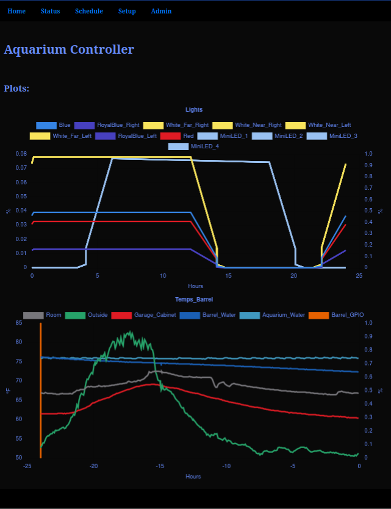
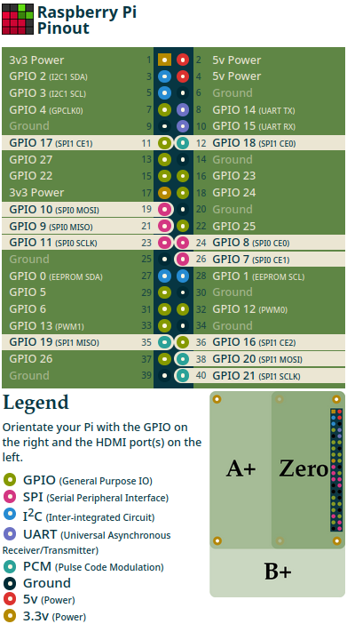

# Aquarium Controller Framework




This framework is an aquarium controller implementation using Python/Flask/SQLite in a Raspberry Pi, to control various hardware items directly connected to the RPi. The framework supports reading values from hardware, writing an output to hardware based on both a schedule and in reaction to read values.

## Currently Implemented hardware support:
- TLC59711 LED Driver
- TLC5947 LED Driver (not tested)
- DS18B20 Temperature Sensor
- RPi GPIO Discrete Outputs
- Virtual hardware

## Future/Potential hardware support:
- Additional SPI devices
- I2C devices

## Installation

Designed to be hosted on a RPi device
Make sure that the following packages are installed on your RPi:
- python3-bcrypt
- python3-flask
- python3-flask-login
- python3-spidev
- python3-rpi.gpio
- nginx
- supervisor

Copy the contents of the src/ folder to your directory structure.
Restart nginx and supervisor services.

To check on status in terminal:
```bash
sudo systemctl status nginx
sudo systemctl status supervisor
sudo supervisorctl status all
```
## Hardware Connections
Images from [https://pinout.xyz/](https://pinout.xyz/)
### 1W


### SPI
Use the SPI0 pins - particularly SPI0 MOSI and SPI0 SCLK



## Usage
- In a browser, go to your RPi's address.
- The first time you visit, the app will have you create an admin account
- Click on 'Setup' to configure what hardware you have connected.
- Within Setup are a number of sub-menus to configure your hardware devices and channels.
- Click on 'Schedule' to start scheduling your outputs.
